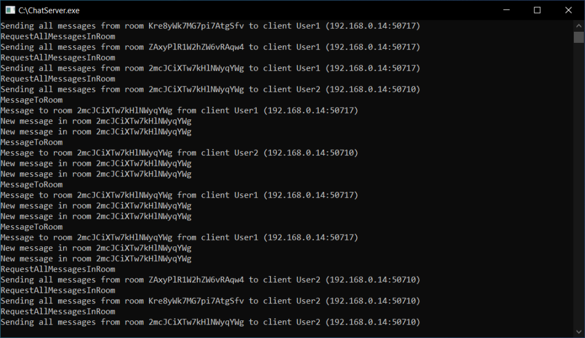

# Chat-Server
Server of basic chat application based on transmission control protocol (TCP).
## Features
* Hosting of multiple rooms where clients are able to chat
## Screenshot

## Libraries used in this project:
* [Newtonsoft.Json](https://www.newtonsoft.com/json)
* [Microsoft.Tookit.Mvvm](https://github.com/CommunityToolkit/WindowsCommunityToolkit)
